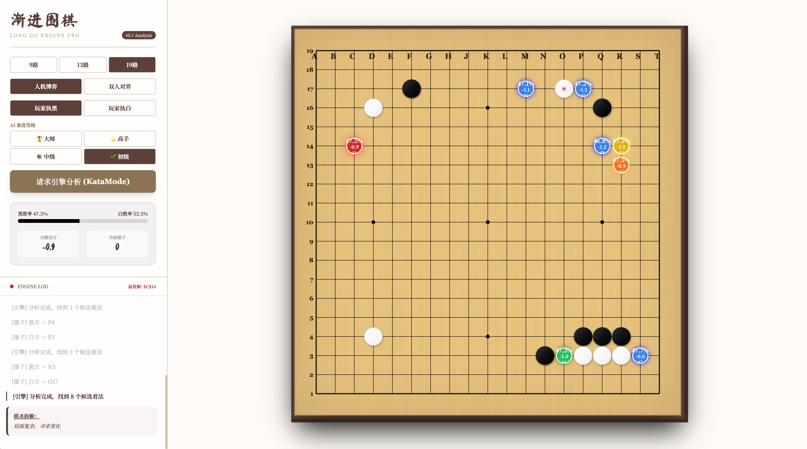

# 渐进围棋 LongGo - 专业 AI 围棋应用

<div align="center">


一款融合传统围棋与前沿 AI 技术的现代化围棋应用，专业级棋局分析，支持多种棋盘规格和深度战略洞察。

[功能特性](#功能特性) • [快速开始](#快速开始) • [使用说明](#使用说明) • [技术架构](#技术架构) • [开发指南](#开发指南)

</div>

---

## 📋 目录

- [项目简介](#项目简介)
- [功能特性](#功能特性)
- [界面预览](#界面预览)
- [环境要求](#环境要求)
- [快速开始](#快速开始)
- [配置说明](#配置说明)
- [使用说明](#使用说明)
- [项目结构](#项目结构)
- [技术架构](#技术架构)
- [技术栈](#技术栈)
- [API 集成](#api-集成)
- [开发指南](#开发指南)
- [构建部署](#构建部署)
- [常见问题](#常见问题)
- [贡献指南](#贡献指南)
- [开源协议](#开源协议)
- [致谢](#致谢)

---

## 🎯 项目简介

**渐进围棋（LongGo）** 是一款现代化的 Web 围棋应用，将传统围棋玩法与尖端 AI 分析技术完美结合。基于 React 和 TypeScript 构建，利用 Google Gemini AI 提供媲美 KataGo 的专业级棋局分析、着法建议和战略洞察。
### 核心亮点

- 🎮 **多种棋盘规格**：支持 9×9、13×13 和 19×19 三种标准棋盘
- 🤖 **AI 智能分析**：实时着法建议与胜率计算
- 📊 **专业数据指标**：目数估计、形势判断、战略推理
- 🎨 **优雅界面设计**：传统美学与现代用户体验的完美融合
- ⚡ **实时引擎响应**：毫秒级 AI 反馈，专业级分析质量
- 🌐 **跨平台支持**：在任何现代浏览器中流畅运行

---

## ✨ 功能特性

### 对弈模式

- **人机对弈（引擎分析模式）**：与 Gemini 驱动的 AI 引擎对弈
- **双人对弈（本地模式）**：本地双人练习模式

### AI 能力

- **着法建议**：提供最优着法推荐，标准坐标标记
- **胜率分析**：实时计算黑白双方胜率概率
- **目数估计**：精确的地盘和领先目数预测
- **战略推理**：专业术语解读（见合、手筋、势、先手等）
- **深度分析模式**：随时请求详细局面评估

### 棋局功能

- **标准围棋规则**：完整实现提子机制和打劫规则
- **着手历史**：追踪和回顾对局进程
- **提子计数器**：实时统计双方提子数
- **最后着手标记**：可视化高亮最近一手棋
- **AI 提示可视化**：棋盘上直接显示建议着点

### 用户界面

- **响应式设计**：针对桌面端和移动端优化
- **实时日志**：实况棋局解说和引擎分析
- **专业美学**：传统围棋棋盘风格与现代化打磨
- **流畅动画**：顺滑的过渡效果和视觉反馈

---

## 🎬 界面预览

### 应用主界面

应用采用分栏式设计：
- **左侧面板**：游戏控制、AI 分析指标、实时引擎日志
- **右侧面板**：可交互的围棋棋盘与落子操作

### AI 分析展示



- 动态进度条可视化胜率
- 目数领先估计
- 提子数统计
- 专业术语的战略推理说明

---

## 📦 环境要求

开始之前，请确保已安装以下环境：

- **Node.js**：16.x 或更高版本
- **npm**：7.x 或更高版本（随 Node.js 一起安装）
- **Google Gemini API 密钥**：AI 功能必需

### 获取 Gemini API 密钥

1. 访问 [Google AI Studio](https://makersuite.google.com/app/apikey)
2. 使用 Google 账号登录
3. 创建新的 API 密钥
4. 复制密钥用于配置

---

## 🚀 快速开始

### 1. 克隆仓库

```bash
git clone https://github.com/yourusername/long-go.git
cd long-go
```

### 2. 安装依赖

```bash
npm install
```

这将安装所有必需的包：
- `react` & `react-dom`：UI 框架
- `@google/genai`：Gemini AI SDK
- `vite`：构建工具和开发服务器
- `typescript`：类型安全
- `@vitejs/plugin-react`：Vite 的 React 支持

---

## ⚙️ 配置说明

### 环境变量

在项目根目录创建 `.env.local` 文件：

```bash
GEMINI_API_KEY=你的API密钥
```

**重要提示**：切勿将 API 密钥提交到版本控制系统。`.env.local` 文件已包含在 `.gitignore` 中。

### Vite 配置

项目使用 Vite 进行开发和构建。配置文件位于 `vite.config.ts`：

```typescript
{
  server: {
    port: 3000,
    host: '0.0.0.0'
  },
  define: {
    'process.env.API_KEY': JSON.stringify(env.GEMINI_API_KEY)
  }
}
```

---

## 🎮 使用说明

### 开发模式

启动开发服务器：

```bash
npm run dev
```

应用将在 `http://localhost:3000` 运行

### 对弈操作

1. **选择棋盘规格**：在 9×9、13×13 或 19×19 中选择
2. **选择对弈模式**：
   - **引擎分析**：与 AI 对弈
   - **双人对弈**：本地双人模式
3. **落子**：点击交叉点放置棋子
4. **请求分析**：点击"请求引擎分析"获取 AI 建议
5. **查看指标**：实时监控胜率和目数估计

### AI 分析功能

AI 提供以下信息：
- **坐标**：标准记谱法的建议着点（如 Q16）
- **胜率**：获胜概率（0-100%）
- **目数领先**：估计的点数优势
- **战略推理**：对着法的专业解读

---

## 📁 项目结构

```
long-go/
├── components/          # React 组件
│   ├── Board.tsx       # 主棋盘组件
│   └── Stone.tsx       # 单个棋子渲染
├── logic/              # 游戏逻辑
│   └── goEngine.ts     # 围棋规则实现
├── services/           # 外部服务
│   └── geminiService.ts # Gemini AI 集成
├── types.ts            # TypeScript 类型定义
├── App.tsx             # 主应用组件
├── index.tsx           # 应用入口
├── index.html          # HTML 模板
├── vite.config.ts      # Vite 配置
├── tsconfig.json       # TypeScript 配置
├── package.json        # 项目依赖
└── README.md           # 本文件
```

### 核心文件说明

- **`App.tsx`**：主游戏逻辑、状态管理和 UI 布局
- **`types.ts`**：游戏状态、着手和 AI 响应的 TypeScript 接口
- **`logic/goEngine.ts`**：核心围棋规则（提子检测、着手验证）
- **`services/geminiService.ts`**：Gemini API 集成，用于 AI 分析
- **`components/Board.tsx`**：可交互的棋盘渲染和着手处理

---

## 🏗️ 技术架构

### 组件层次结构

```
App（主应用）
├── Sidebar（侧边栏：控制与分析）
│   ├── 游戏设置
│   ├── AI 指标展示
│   └── 引擎日志
└── Board（棋盘）
    └── Stone 组件（棋子）
```

### 状态管理

应用使用 React 的 `useState` 和 `useEffect` Hooks 进行状态管理：

- **GameState（游戏状态）**：棋盘局面、当前玩家、着手历史
- **AI State（AI 状态）**：提示、分析数据、思考状态
- **UI State（界面状态）**：日志、动画、用户交互

### 数据流

1. 用户点击棋盘 → `handleMove()` 验证并更新状态
2. 状态变化触发 AI 回合（如果在人机模式）
3. `getAIMove()` 调用 Gemini API 传递棋盘局面
4. AI 响应更新棋盘并显示分析
5. UI 通过动画和日志反映新状态

---

## 🛠️ 技术栈

### 前端技术

- **React 19.2.3**：基于 Hooks 的 UI 框架
- **TypeScript 5.8.2**：类型安全开发
- **Vite 6.2.0**：快速构建工具和开发服务器
- **Tailwind CSS**：实用优先的样式（通过内联类）

### AI 与后端

- **Google Gemini API**：AI 驱动的棋局分析
- **@google/genai SDK**：官方 Gemini 客户端库

### 开发工具

- **@vitejs/plugin-react**：React Fast Refresh 支持
- **@types/node**：Node.js 类型定义

---

## 🤖 API 集成

### Gemini 服务

`geminiService.ts` 模块处理所有 AI 交互：

```typescript
export const getAIMove = async (
  board: Stone[][],
  size: BoardSize,
  player: Stone,
  isHint: boolean = false
): Promise<AIHint | null>
```

### API 请求流程

1. 将棋盘状态转换为坐标记谱
2. 构建包含游戏上下文的提示词
3. 向 Gemini 请求结构化 JSON 响应
4. 解析并验证 AI 响应
5. 将坐标转换回棋盘位置

### 响应数据结构

```typescript
{
  coordinate: string,    // 如 "Q16"
  winRate: number,       // 0-100
  scoreLead: number,     // 正数表示领先
  reason: string         // 战略解释
}
```

---

## 💻 开发指南

### 代码规范

- **TypeScript**：启用严格模式
- **React**：函数式组件配合 Hooks
- **命名规范**：变量使用 camelCase，组件使用 PascalCase
- **注释**：函数使用 JSDoc 风格

### 添加新功能

1. 在 `types.ts` 中定义类型
2. 在相应模块中实现逻辑
3. 更新 UI 组件
4. 使用不同棋盘规格和场景测试

### 调试技巧

- 使用 React DevTools 检查组件
- 查看浏览器控制台的 API 错误
- 监控网络标签页的 Gemini API 调用

---

## 📦 构建部署

### 生产构建

```bash
npm run build
```

这将在 `dist/` 目录创建优化后的构建产物。

### 预览生产构建

```bash
npm run preview
```

### 部署选项

- **Vercel**：Vite 应用零配置部署
- **Netlify**：拖放或 Git 集成
- **GitHub Pages**：使用 Actions 的静态托管
- **自定义服务器**：使用任何 Web 服务器提供 `dist/` 文件夹

### 生产环境变量

确保部署平台已配置 `GEMINI_API_KEY` 环境变量。

---

## 🐛 常见问题

### 常见问题解答

**API 密钥无效**
- 验证密钥在 `.env.local` 中设置正确
- 确保没有多余的空格或引号
- 修改环境变量后重启开发服务器

**AI 无响应**
- 检查浏览器控制台的 API 错误
- 验证网络连接
- 确认 Gemini API 配额未超限

**棋盘无法渲染**
- 清除浏览器缓存
- 检查控制台的 JavaScript 错误
- 确保所有依赖已安装

**构建错误**
- 删除 `node_modules` 和 `package-lock.json`
- 重新运行 `npm install`
- 检查 Node.js 版本兼容性

---

## 🤝 贡献指南

欢迎贡献！请遵循以下指南：

1. **Fork** 本仓库
2. **创建**特性分支（`git checkout -b feature/AmazingFeature`）
3. **提交**更改（`git commit -m '添加某个很棒的功能'`）
4. **推送**到分支（`git push origin feature/AmazingFeature`）
5. **开启** Pull Request

### 开发规范

- 编写清晰、有文档的代码
- 遵循现有代码风格
- 提交前充分测试
- 添加新功能时更新 README

---

## 📄 开源协议

本项目采用 MIT 协议 - 详见 LICENSE 文件。

---

## 🙏 致谢

- **Google Gemini**：提供强大的 AI 能力
- **围棋社区**：提供丰富的战略深度
- **React 团队**：提供优秀的 UI 框架
- **Vite 团队**：提供极速构建工具

---

## 📞 联系与支持

- **问题反馈**：[GitHub Issues](https://github.com/yourusername/long-go/issues)
- **讨论交流**：[GitHub Discussions](https://github.com/yourusername/long-go/discussions)

---

<div align="center">

**用 ❤️ 为围棋爱好者和 AI 学习者打造**

⭐ 如果觉得有帮助，请给个 Star！

</div>